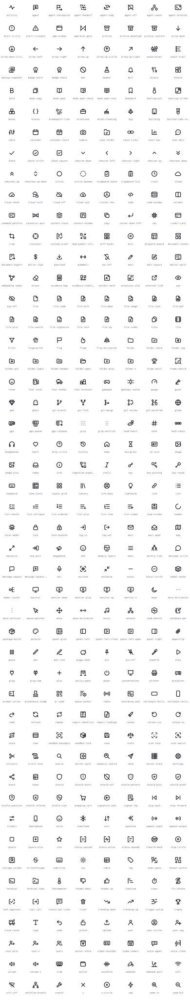

<div align="center">
  <picture>
    <source media="(prefers-color-scheme: dark)" srcset="https://cdn.burtson.ai/logos/burtson-labs-logo-alt.png" />
    <source media="(prefers-color-scheme: light)" srcset="https://cdn.burtson.ai/logos/burtson-labs-logo.png" />
    
  </picture>

# Burtson Icons

**Open-source stroke icons for the tools we build: AI agents, security audits, provenance, infrastructure and evidence work.**

24px grid · 2px stroke · `currentColor` · zero runtime dependencies

[](https://icons.burtson.ai)
[](https://www.npmjs.com/package/@burtson-labs/icons)
[](LICENSE)
[](https://github.com/Burtson-Labs/icons/actions/workflows/ci.yml)

** Browse, search and copy every icon at [icons.burtson.ai](https://icons.burtson.ai)**

</div>

---

##  The set

<!-- icons:start (generated by npm run build) -->

**230 icons** · Agents & AI 30 · Development 30 · Security 21 · Provenance & audit 11 · Infrastructure 25 · Data 18 · Evidence & video 10 · Voice & audio 11 · Documents & reports 11 · Status 25 · Interface 84 · People 8 · Recreation 3 · Burtson Labs 2 · Logistics & operations 4 · Files & folders 13

<picture>
  <source media="(prefers-color-scheme: dark)" srcset="preview/sheet-dark.svg" />
  <source media="(prefers-color-scheme: light)" srcset="preview/sheet-light.svg" />
  
</picture>
<!-- icons:end -->

The set is young and growing. [`design/backlog.json`](design/backlog.json) lists the next few hundred icons, and `npm run status` shows progress by category.

##  Install

```bash
npm i @burtson-labs/icons
```

### React

```tsx
import { ShieldProof, MerkleTree } from '@burtson-labs/icons/react';

<ShieldProof size={20} strokeWidth={1.75} className="text-emerald-600" />;
```

Components forward refs and pass every other prop to the `<svg>`. `absoluteStrokeWidth` keeps the stroke the same thickness at any size. React is an optional peer dependency. The core package doesn't need it.

### Plain JavaScript

```js
import { toSvg, gpu } from '@burtson-labs/icons';

el.innerHTML = toSvg('waveform', { size: 20, color: '#a60ee5' });
el.innerHTML = toSvg(gpu); // named exports are the raw nodes, so bundlers tree-shake the rest
```

### SVG files, sprite and JSON

| Want               | Use                                                                                                                                           |
| ------------------ | --------------------------------------------------------------------------------------------------------------------------------------------- |
| One file           | `@burtson-labs/icons/svg/<name>.svg`, or `https://icons.burtson.ai/svg/<name>.svg`                                                            |
| A sprite           | `@burtson-labs/icons/sprite.svg`, served from your own origin, with `<use href="/sprite.svg#<name>" />` (browsers block cross-origin `<use>`) |
| Everything as data | `@burtson-labs/icons/icons.json`: names, tags, categories and geometry                                                                        |

##  Design rules

Every icon is drawn on a 24×24 grid with a 2px round-capped stroke, geometry only, inside a 1px margin. The rules match the common 24px stroke convention on purpose, so these icons sit next to other sets without looking foreign. The drawings themselves are our own: CI compares every icon against the Lucide set and fails on near-copies. The full spec is in [`design/DESIGN.md`](design/DESIGN.md).

##  Adding icons

```bash
npm install
npm run new -- vram          # blank icon + metadata, pre-filled from the backlog
# draw icons/vram.svg
npm run check                # validate, originality, build, test, site
```

`npm run validate` enforces the grid, root attributes, allowed elements, the 1px margin, two-decimal coordinates and the metadata. Anything a machine can check is checked, so review can focus on the drawing. [`design/PROMPTS.md`](design/PROMPTS.md) has ready-made prompts for drafting batches with an AI model.

##  Repository layout

| Path              | What                                                                    |
| ----------------- | ----------------------------------------------------------------------- |
| `icons/`          | Source: one `.svg` and one `.json` (tags, categories, aliases) per icon |
| `categories.json` | The categories and their descriptions                                   |
| `scripts/`        | Validator, originality check, build, scaffolder, status                 |
| `dist/`           | Built package (generated, published to npm)                             |
| `preview/`        | README sheets and accent icons (generated, committed)                   |
| `site/`           | Generator for [icons.burtson.ai](https://icons.burtson.ai)              |
| `design/`         | Spec, backlog and drafting prompts                                      |

## License

[ISC](LICENSE) © Burtson Labs. Use the icons anywhere, including commercial work. Attribution is welcome but not required beyond keeping the license notice with copies of the package.
